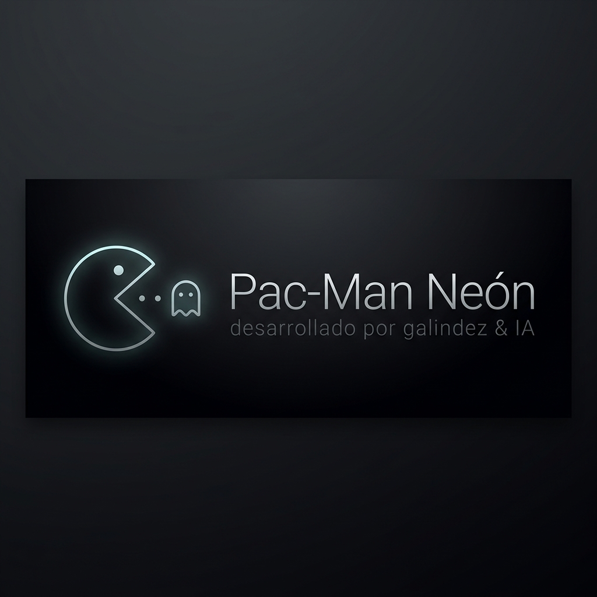

# 👻 Pac-Man Neón

Una hiper-estilizada versión Cyberpunk del clásico arcade **Pac-Man**. Explora un laberinto vectorizado recuperando fragmentos de datos, mientras esquivas a las anomalías centinela (Fantasmas Inteligentes). Todo renderizado a puro 60 FPS con un motor híbrido y música Lofi/Cyberpunk atmosférica. Este proyecto forma parte de la **Franquicia Neón** y conserva estrictamente la arquitectura táctil-teclado de sus predecesores.

---

## 🕹️ Mecánicas de Juego

- Mueve a Pac-Man para comer todos los puntos del mapa.
- Evita que los fantasmas te atrapen, perderás vida.
- Come los Puntos de Poder (esferas más grandes) para invertir la carga: los fantasmas se volverán vulnerables y podrás comerlos por puntos masivos.
- El juego monitorea y guarda de manera local tu **High Sync** (Récord Local).

## 💻 Controles Híbridos Universales

Este motor está cuidadosamente construido para operar fluidamente sin importar desde qué dispositivo juegues:

- **En PC:**
  - **Arriba / Abajo / Izquierda / Derecha** (o **W / A / S / D**): Cambia de dirección instantáneamente.
  - **P**: Pausar la partida.
- **En Móviles:**
  - **D-Pad Virtual**: Usa la cruceta digital en la zona inferior de la pantalla para realizar los giros dentro del laberinto.
- **Protección Inteligente:** Los controles previenen el recargo accidental de tu partida (`beforeunload`) para bloquear salidas furtivas por accidente.

## 🛠️ Tecnologías y Arquitectura

Desarrollado bajo el marco visual de la franquicia Neón:

- **React 19 + TypeScript + Vite**: Base SPA ultra rápida y robusta.
- **Render `<canvas>` de Alto Rendimiento**: Pura manipulación matemática en un `requestAnimationFrame` que independiza el motor físico del DOM.
- **Tailwind v4 CSS + Motion (Framer)**: Animaciones de HUD, interfaces cristalinas (Glassmorphism) y colores flourescentes neón (`neon-cyan` y `neon-magenta`).
- **Autoplay Inteligente**: El reproductor musical inicializa solo tras el primer tap para lidiar con el bloqueo de auto-play en navegadores móviles estándar.
