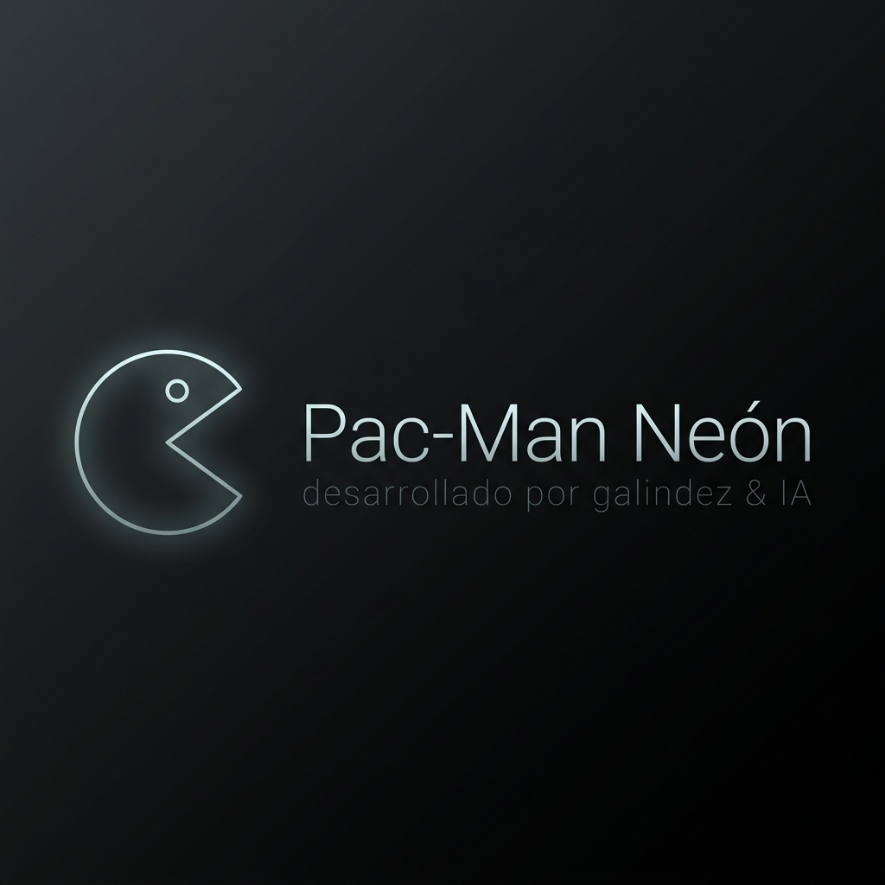

<div align="center">
  
  
  # 🍒 Pac-Man Neón
  
  **Un tributo cyberpunk moderno al clásico juego de laberintos.**
  
  [**🎮 JUEGA AHORA EN VIVO**](https://juegopac-man-948774944187.europe-west1.run.app/)

</div>

---

## 🌟 Descripción

**Pac-Man Neón** revoluciona el clásico juego de laberinto combinando un diseño **cyberpunk** y *glassmorphism*. El juego presenta controles responsivos tanto para teclado en computadora como mediante controles táctiles para dispositivos móviles.

El proyecto está diseñado usando el `<canvas>` nativo de HTML5 para un renderizado brillante, simulando las luces de neón con técnicas visuales óptimas.

## 🚀 Arquitectura del Proyecto

El sistema está construido bajo los siguientes pilares tecnológicos y arquitectónicos:

- **Framework y UI**: 
  - Desarrollado como una *Single Page Application (SPA)*.
  - Basado en **React 19** y empaquetado con **Vite**.
  - Tipado de datos estricto usando **TypeScript**.
  - Estilizado utilizando **Tailwind CSS V4** (configuración de neones personalizados vía utilidades arbitrarias).
  
- **Motor Gráfico y Logica**:
  - Un bucle de renderizado optimizado con la API Canvas en 2D que aísla visualmente el estado del tablero (sistema de cuadrículas, colisiones y fantasmas).
  
- **Infraestructura y Despliegue Automático (CI/CD)**:
  - Encontrándose desplegado en Google Cloud Run a través de **Google Cloud Build** (`cloudbuild.yaml`).
  - Utiliza un `Dockerfile` en configuración multietapa. Hospedado sobre un servidor optimizado ajustado para el puerto `8080`.

## 🕹️ Cómo Jugar

1. **Escritorio**: Utiliza las **Flechas del Teclado** o las teclas **W A S D** para guiar a Pac-Man a través del laberinto.
2. **Móviles**: Tienes a tu disposición controles táctiles (botones direccionales en pantalla o soporte de deslizamiento swipe).
3. ¡Come todos los puntos del laberinto para pasar de nivel y evita a los fantasmas de neón!

## ⚙️ Correr en Local (Desarrollo)

Siga estas instrucciones para levantar el proyecto a nivel local:

**Requisitos Previos:** **Node.js** (versión 18+) y Git.

1. **Clonar e Ingresar al repositorio**:
   ```bash
   git clone https://github.com/tu-usuario/JuegoPAC-MAN.git
   cd JuegoPAC-MAN
   ```

2. **Instalar Dependencias**:
   ```bash
   npm install
   ```

3. **Ejecutar el Servidor de Desarrollo**:
   ```bash
   npm run dev
   ```

4. **Visualizar el Proyecto**:
   Abre una pestaña en tu navegador web hacia la dirección local indicada en consola (usualmente `http://localhost:5173`).

## 📜 Licencia y Créditos

Proyecto desarrollado por **Galindez & IA**.
